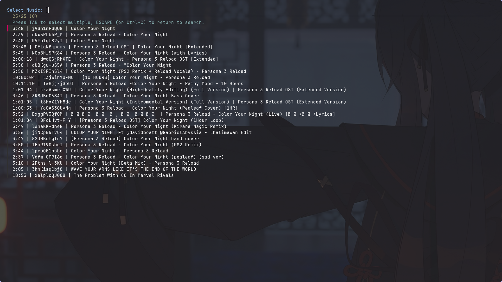

# Archify.

Archify is a Bash script that allows you to **download music from YouTube effortlessly** using `yt-dlp`, automatically embedding cover images. It also comes with a music player toggle script using `mpv` that supports shuffle and infinite loop. Perfect for Linux users who want to build an **offline music collection** quickly and easily.

## Features

- Download music from YouTube using keywords.
- Search up to 25 results at a time.
- Interactive selection of songs with `fzf`.
- Convert audio to **MP3** format.
- Automatically embed thumbnail as cover image.
- Music player toggle script with:
  - Shuffle mode
  - Infinite playlist loop
  - No-video playback
- Simple Bash scripts, no GUI required.

## Screenshot



---

## Prerequisites / Dependencies

Make sure your Linux system has the following installed:

- `bash` (default on most Linux distributions)
- `yt-dlp` → for downloading music from YouTube
- `mpv` → for music playback
- `fzf` → interactive fuzzy finder for selecting music
- `ffmpeg` → used by `yt-dlp` for audio conversion and thumbnail embedding

## Installation

### 1. Debian-based Linux (Ubuntu, Mint, Debian)

```bash
sudo apt update
sudo apt install -y yt-dlp mpv fzf ffmpeg
````

### 2. Fedora-based Linux (Fedora, RHEL)

```bash
sudo dnf install -y yt-dlp mpv fzf ffmpeg
```

### 3. Arch-based Linux (Arch, Manjaro)

```bash
sudo pacman -Syu yt-dlp mpv fzf ffmpeg
```

### 4. Clone this repository

```bash
git clone https://github.com/Soralith/Archify.git
cd Archify
```

### 5. Make scripts executable

```bash
chmod +x music-download.sh
chmod +x music-toggle.sh
```

### 6. Run the downloader

```bash
./music-download.sh
```

---

## Usage

### Download Music

* Run `./music-download.sh`.
* Enter a keyword for the music you want.
* Press `TAB` to select multiple songs, then `Enter` to download.
* Downloaded MP3 files with embedded cover images will be saved in `~/Music` by default.
* Press `q` and `Enter` to exit the script.

### Play / Toggle Music

* Run `./music-toggle.sh` to start or toggle music playback in `~/Music`.
* If `mpv` is already running, the script will stop it first and restart playback.
* Shuffle and infinite loop are enabled by default.
* Playback is audio-only (no video).

## Directory Structure

```
archify/
├── music-download.sh    # Main music downloader script
├── music-toggle.sh      # Music player toggle script using mpv
└── README.md            # This file
```

---

## Hyprland Integration (Optional)

If you use **Hyprland** as your window manager, you can create custom keybinds to control your music scripts without opening a terminal. Here’s an example setup:

```ini
bind = SUPER+Ctrl+Shift, Space, exec, $musicToggle
bind = SUPER+Shift, KP_Add, exec, echo 'playlist-next' | socat - /tmp/mpvsocket
bind = SUPER+Shift, KP_Subtract, exec, echo 'playlist-prev' | socat - /tmp/mpvsocket
bind = SUPER, N, exec, pkill -f "mpv.*Music"
bind = SUPER+Ctrl, M, exec, $musicDownload
```

* `$musicToggle` = path to `music-toggle.sh`, e.g.:

```bash
$musicToggle = ~/.config/hypr/scripts/Music/music-toggle.sh
```

* `$musicDownload` = path to `music-download.sh`, e.g.:

```bash
$musicDownload = <your_terminal_apps> ~/.config/hypr/scripts/Music/music-download.sh
```

* Make sure scripts are executable:

```bash
chmod +x ~/.config/hypr/scripts/Music/music-toggle.sh
chmod +x ~/.config/hypr/scripts/Music/music-download.sh
```

Once set up, you can toggle music playback, skip tracks, stop the player, or launch the downloader directly from your keyboard, giving you **full control without leaving your workflow**.

> Tip: You can customize the keybinds to any combination that feels comfortable.

---

## Notes

* Make sure you have enough storage in `~/Music`.
* `yt-dlp` might fail if YouTube changes its API. Update regularly:

```bash
yt-dlp -U
```

* Covers are embedded automatically if available, but not all videos have thumbnails.

## Contributing

Feel free to open issues or submit pull requests to improve Archify. Suggestions for features or bug fixes are always welcome!

